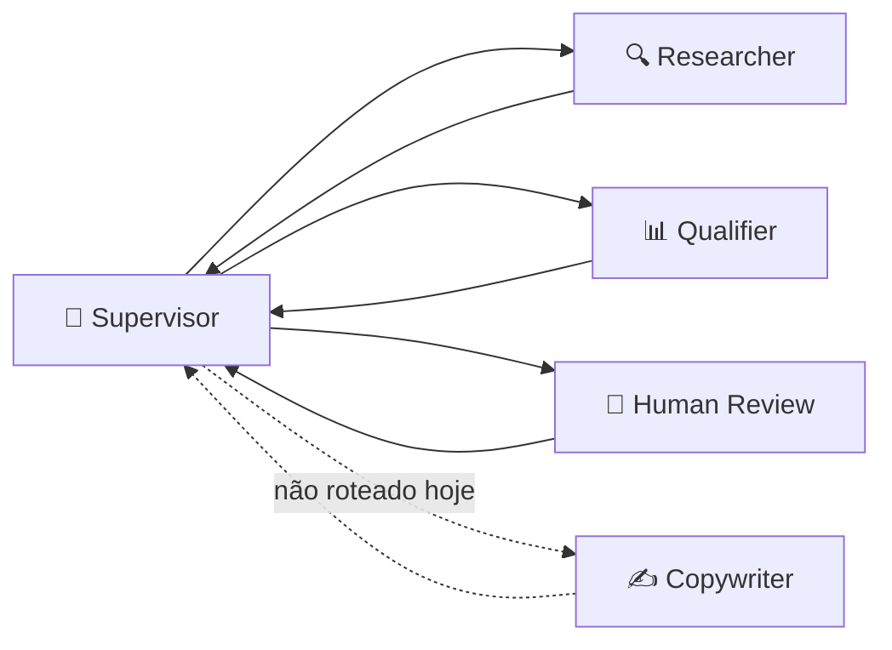
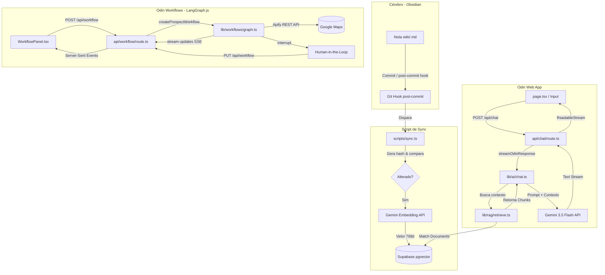

# ⚡ Odin — Cockpit de IA Pessoal & Orquestrador Multi-Agente 🤖

O **Odin** é um assistente de inteligência artificial pessoal com duas grandes capacidades:

1. **Chat com Segundo Cérebro** — Conversação em streaming com RAG sobre um vault Obsidian (pgvector), function calling, voz bidirecional e interface 3D imersiva.
2. **Workflows Multi-Agente** — Orquestração de agentes especialistas via LangGraph.js para tarefas complexas como prospecção B2B, com human-in-the-loop e dados reais do Google Maps.

---

## 🌌 Visão Geral da Interface

A interface do Odin funciona em duas abas: **Chat** (assistente pessoal) e **⚡ Agents** (workflows multi-agente).

* **Robô 3D Interativo (Spline):** Modelo 3D que reage em tempo real — gaze tracking e glow pulse sincronizado com a voz.
* **Background Dinâmico WebGL:** Shader animado em Three.js.
* **Glassmorphism & UI Cyberpunk:** Controles semi-transparentes, tons neon, cursor crosshair.
* **Workflow Panel:** Grafo visual dos agentes com status em tempo real, log de eventos e painel de revisão humana com botão WhatsApp integrado.

---

## 🧠 Recursos Principais

### 1. Chat com RAG Integrado (Obsidian & Supabase) 📚

O Odin lê e indexa notas pessoais do Obsidian, respondendo com contexto real da sua vida e projetos.

* **Indexação Incremental (`npm run sync`):** Verifica alterações via hash SHA-1 e indexa apenas arquivos novos/modificados.
* **Auto-Sync:** Git Hook `post-commit` no vault dispara sincronização automática.
* **Armazenamento Vetorial:** Supabase (PostgreSQL) + `pgvector` com índice HNSW para busca por similaridade ultrarrápida.
* **Embeddings:** `gemini-embedding-001` otimizados para 768 dimensões.

### 2. Conversação por Voz (STT & TTS) 🎙️

* **Speech-to-Text (STT):** Web Speech API com envio automático na pausa natural.
* **Text-to-Speech (TTS):** OpenAI TTS (`tts-1`, voz onyx), em fila por frase para falar enquanto o resto é gerado.
* **Modo Conversa Contínua (Hands-Free):** Meia-duplex com reativação automática do microfone.
* **Glow Pulse (Lip-Sync Visual):** Anel neon pulsa no ritmo da voz via Web Audio (`AnalyserNode`).
* **Barge-in:** Áudio interrompido ao iniciar novo comando.

### 3. Function Calling 🛠️

O Odin executa ações no servidor via loop de ferramentas:

* **`searchSecondBrain`:** Busca semântica no vault Obsidian.
* **`readObsidianNote`:** Lê nota inteira (com guard de path-traversal e confidencialidade).
* **`webSearch`:** Busca web via Tavily (fallback mock sem chave).
* **`getSurfForecast`:** Surf e tempo em Peruíbe/SP via Open-Meteo (Marine + Weather).

### 4. Workflows Multi-Agente (LangGraph.js) 🔗

Módulo de orquestração de agentes especialistas usando **LangGraph.js** com padrão **Supervisor (Hub-and-Spoke)**.

#### Arquitetura do Grafo



> ⚠️ **Estado real:** o caminho que executa hoje é `researcher → qualifier → human_review`.
> O nó **Copywriter existe no grafo mas o Supervisor nunca roteia para ele** — a aresta
> pontilhada é intencional neste diagrama. Ver [`docs/ESTADO.md`](./docs/ESTADO.md) §2.

#### Agentes Especialistas

| Agente | Papel | Tecnologia | Estado |
|--------|-------|------------|--------|
| **Supervisor** | Roteador determinístico — decide o próximo estágio a partir do estado | Regras TypeScript (sem LLM) | ✅ ativo |
| **Researcher** | Pesquisa leads reais com dados estruturados | Apify Google Maps Scraper (fallback: Tavily → mock) | ✅ ativo |
| **Qualifier** | Avalia todos os leads de uma vez (score 0-10, oportunidades) | Gemini 3.5 Flash + Structured Output | ✅ ativo |
| **Copywriter** | Escreveria a mensagem WhatsApp (máx. 5 linhas, tom inferido do segmento) | Gemini 3.5 Flash + prompt battle-tested | ⚠️ **inalcançável** — prompt pronto, nó nunca executa |
| **Human Review** | Pausa o workflow via `interrupt()` para revisão humana | LangGraph HITL | ✅ ativo |

#### Funcionalidades do Workflow

* **Apify Google Maps Integration:** Dados reais de empresas (nome, telefone, website, rating, endereço, URL do Maps).
* **Human-in-the-Loop:** O workflow pausa via `interrupt()` e exibe a tabela de leads antes de qualquer ação externa. Hoje a UI oferece apenas **Concluir** (`approve`) — os caminhos `reject`/`edit` existem no backend sem gatilho na interface.
* **Link Google Maps:** "📍 Ver no Maps" para cada lead.
* **Link wa.me:** "📲 WhatsApp" abre a conversa com o número já normalizado (`https://wa.me/{phone}`). ⚠️ **Sem mensagem pré-carregada** — o `?text=` depende do Copywriter, que ainda não é roteado.
* **Streaming SSE:** Progresso em tempo real (qual agente está rodando, resultados parciais, interrupções).
* **Checkpointing:** MemorySaver (dev, `globalThis` singleton). O caminho Redis existe em código mas o pacote não está instalado — hoje é sempre MemorySaver.
* **Qualificação em batch:** uma única chamada estruturada qualifica todos os leads e os ordena por score. Substituiu o desenho anterior de rotação lead-a-lead (ver [ADR-0006](./docs/adr/README.md)).

### 5. Engenharia de Chat Robusta & Agnóstica ⚡

* **Provider Isolado:** Contrato estável de streaming. Gemini hoje, agnóstico para multi-modelos.
* **Retry com Backoff:** Rate limit (429) e sobrecarga (503) repetidos com backoff exponencial.
* **Fail-Safe:** Supabase offline? RAG falha silenciosamente. Sem chave Apify? Cai no Tavily. Sem Tavily? Mock. O Odin nunca trava.

---

## 🏗️ Arquitetura do Fluxo de Dados



---

## 🛠️ Tecnologias Utilizadas

| Camada | Tecnologia |
|--------|-----------|
| **Framework** | Next.js 16.2 (App Router, Turbopack) |
| **Estilização** | Tailwind CSS v4, Vanilla CSS (Glassmorphism) |
| **3D / Gráficos** | `@splinetool/react-spline` & `Three.js` (WebGL Shader) |
| **Banco de Dados** | Supabase (PostgreSQL) + `pgvector` |
| **IA (Chat)** | `@google/genai` (Gemini 3.5 Flash) com Function Calling |
| **IA (Workflows)** | `@langchain/langgraph` (StateGraph, Supervisor Pattern) |
| **Scraping** | Apify REST API (Google Maps Scraper) |
| **Voz** | Web Speech API (STT) + OpenAI TTS + Web Audio |
| **Dados Externos** | Open-Meteo (Marine & Weather) para surf |

---

## 🚀 Como Rodar o Projeto Localmente

### 1. Clonar o repositório
```bash
git clone https://github.com/gfrabelo/odin.git
cd odin
```

### 2. Configurar Variáveis de Ambiente
```bash
cp .env.local.example .env.local
```
Preencha com suas credenciais:

| Variável | Obrigatória | Descrição |
|----------|:-----------:|-----------|
| `GEMINI_API_KEY` | ✅ | Chave API do Google AI Studio |
| `OPENAI_API_KEY` | — | Para voz (TTS). Sem ela, chat funciona sem áudio |
| `SUPABASE_URL` | — | URL do projeto Supabase (RAG) |
| `SUPABASE_SERVICE_ROLE_KEY` | — | Service role key do Supabase |
| `VAULT_PATH` | — | Caminho local do vault Obsidian (padrão: `../segundo-cerebro`) |
| `APIFY_API_TOKEN` | — | Token API Apify para Google Maps Scraper (Workflows) |
| `SEARCH_API_KEY` | — | Chave Tavily para busca web real |

### 3. Configurar o Banco de Dados (Supabase)
Execute as queries em `supabase/schema.sql` no painel SQL Editor do Supabase.

### 4. Instalar Dependências e Rodar
```bash
npm install
npm run dev
```
Cockpit ativo em [http://localhost:3000](http://localhost:3000).

### 5. Sincronizar o Vault Obsidian (RAG)
```bash
npm run sync
```

---

## ✅ Entregue

* [x] Chat em streaming com Gemini (fallback OpenAI)
* [x] RAG sobre vault Obsidian via Supabase/pgvector
* [x] Function Calling (4 tools: searchSecondBrain, readObsidianNote, webSearch, getSurfForecast)
* [x] Voz bidirecional (STT nativo + TTS OpenAI) com modo contínuo hands-free
* [x] Glow Pulse sincronizado com voz (Web Audio AnalyserNode)
* [x] Barge-in inteligente
* [x] UI imersiva com robô 3D (Spline), glass UI, background WebGL
* [x] **Workflow Multi-Agente (LangGraph.js)** — grafo hub-and-spoke com supervisor determinístico
* [x] **Apify Google Maps Scraper** — leads reais com telefone, website, rating
* [x] **Qualificação em batch** — uma chamada estruturada qualifica e ranqueia todos os leads
* [x] **Human-in-the-loop** — `interrupt()`/resume com checkpointing
* [x] **Link wa.me** — botão que abre a conversa com o número normalizado
* [x] **Fail-safe em cascata** — Apify → Tavily → mock; Supabase offline → RAG silencioso

> Para o retrato completo e verificado — incluindo o que **não** funciona — ver
> [`docs/ESTADO.md`](./docs/ESTADO.md). Este checklist lista entregas; aquele documento
> lista lacunas, com `arquivo:linha`.

## 🗺️ Roadmap

**Destrava caixa (próximo)**
* [ ] **Rotear o Copywriter** — o prompt está pronto e o nó nunca executa. Sem isso o pipeline entrega tabela sem mensagem
* [ ] **`?text=` no link wa.me** — a mensagem gerada entra no deep-link, editável antes de enviar
* [ ] **Persistência de Leads no Supabase** — CRM pessoal com histórico; sem isso o mesmo negócio é re-abordado
* [ ] **Guarda de loop no researcher** — contador de tentativas + `recursionLimit` explícito

**Destrava credibilidade**
* [ ] **Harness de evals** — aderência do copywriter às regras, consistência do qualifier, recall do RAG
* [ ] **`typecheck` + CI** — lint, typecheck e build no push
* [ ] **Recuperação escopada por domínio** — parsear frontmatter no sync (ver [ADR-0010](./docs/adr/0010-metadado-do-frontmatter.md))

**Depois**
* [ ] **Deploy Railway + Redis** — checkpointing persistente + HTTPS
* [ ] **Persistência de Conversas** — múltiplos chats com histórico
* [ ] **Visão Multimodal** — enviar imagens/screenshots para análise
* [ ] **Escrita no Vault** (`writeObsidianNote`) — ⚠️ revoga o [ADR-0002](./docs/adr/0002-vault-fonte-de-verdade.md); exige decisão explícita antes

**Descartado**
* ~~Sender Node (Uazapi/Z-API)~~ — o `wa.me` + clique humano é melhor até o volume exigir: custo zero, risco de ban zero, humano no loop por construção. Ver [ADR-0007](./docs/adr/README.md)
