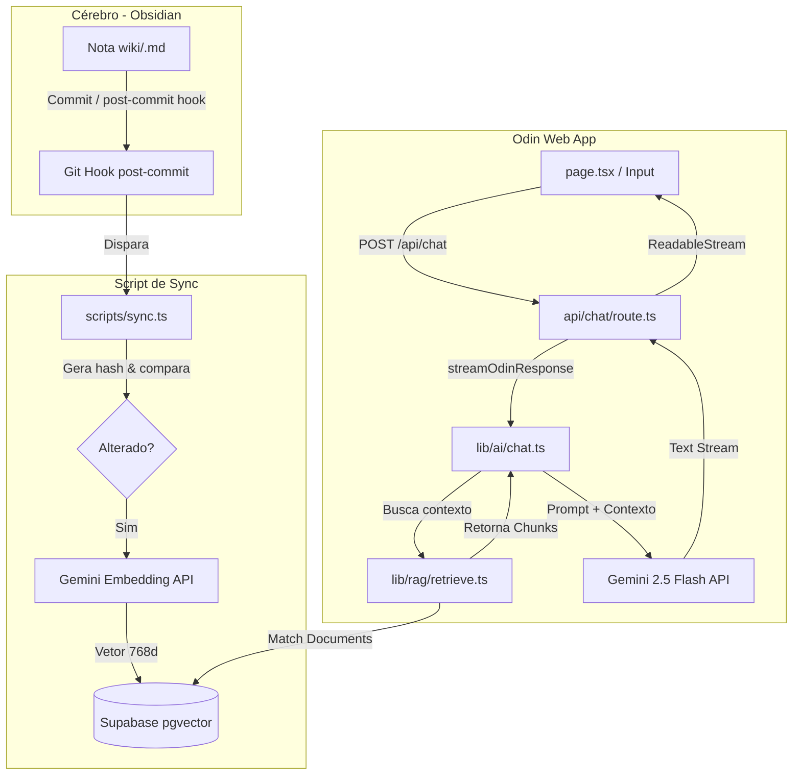

# ⚡ Odin - O Cockpit de IA & Segundo Cérebro do Futuro 🤖

O **Odin** é um assistente de inteligência artificial pessoal projetado para funcionar como um orquestrador de conhecimento e um segundo cérebro externo. Ele une uma interface visual altamente imersiva e futurista de "cockpit" com uma camada avançada de **RAG (Retrieval-Augmented Generation)** conectada diretamente a um vault do Obsidian.

---

## 🌌 Visão Geral da Interface

A interface do Odin foi concebida para parecer um terminal de comando premium e interativo:
* **Robô 3D Interativo (Spline):** Um modelo 3D no centro da tela que reage em tempo real, acompanhando a movimentação do seu cursor com o olhar (*gaze tracking*).
* **Background Dinâmico WebGL:** Um background animado de shader rodando em Three.js por trás do cockpit.
* **Aparência Glassmorphism & UI Cyberpunk:** Controles semi-transparentes com efeito de vidro fosco, tons neon de ciano e cinza escuro, além de um cursor customizado em formato de mira (*crosshair*).
* **Modo de Voz Integrado:** Controle completo por voz (fala e escuta) com feedbacks dinâmicos na tela.

---

## 🧠 Recursos Principais

### 1. Camada RAG Integrada com Obsidian & Supabase 📚
O Odin lê e indexa as suas notas pessoais armazenadas em um vault do Obsidian em formato Markdown, permitindo que a IA responda com contexto real da sua vida, projetos e anotações.
* **Indexação Incremental (`npm run sync`):** Um script que verifica alterações nas notas usando hash SHA-1 e indexa apenas arquivos alterados ou novos no banco de dados.
* **Auto-Sync:** Integrado com um Git Hook `post-commit` no vault Obsidian: ao commitar notas novas ou modificações no wiki, o Odin sincroniza o banco de dados automaticamente.
* **Armazenamento Vetorial:** Banco de dados **Supabase (PostgreSQL)** com a extensão `pgvector` e índice HNSW para busca por similaridade de cosseno ultrarrápida.
* **Embeddings Eficientes:** Embeddings gerados a partir do `gemini-embedding-001` otimizados para 768 dimensões.

### 2. Conversação por Voz (STT & TTS) 🎙️
* **Speech-to-Text (STT):** O Odin transcreve sua voz ao vivo através do navegador (Web Speech API) e envia o comando automaticamente quando você faz uma pausa natural.
* **Text-to-Speech (TTS):** O Odin lê as respostas com voz natural via **OpenAI TTS** (voz `onyx`, velocidade ajustável), em fila por frase para começar a falar enquanto o resto ainda é gerado.
* **Modo Conversa Contínua (Hands-Free):** Botão de headset que mantém o microfone ativo entre os turnos - você fala, o Odin responde, e o mic religa sozinho, sem clicar. Funciona em **meia-duplex** (mic pausa enquanto o Odin fala) para evitar eco no alto-falante.
* **Glow Pulse (Lip-Sync Visual):** Um anel neon pulsa atrás da cabeça do robô no ritmo exato da voz do Odin, sincronizado via Web Audio (`AnalyserNode`).
* **Cancelamento Inteligente / Barge-in:** O áudio é interrompido imediatamente ao iniciar um novo comando, desativar a voz, ou (com fones) ao começar a falar por cima do Odin.

### 3. Ações & Function Calling 🛠️
O Odin não é só um chatbot passivo - ele executa ações através de um loop de ferramentas no servidor:
* **`searchSecondBrain`:** busca semântica dirigida no vault (além do RAG automático).
* **`readObsidianNote`:** lê uma nota inteira do Obsidian (com guard de segurança contra path-traversal).
* **`webSearch`:** busca na web (mock por padrão; pronto para plugar uma Search API real).
* **`getSurfForecast`:** condições de surf e tempo em tempo real para Peruíbe/SP via **Open-Meteo** (Marine + Weather, sem chave) - o Odin comenta ondas, período, swell e vento com tom de surfista.

### 4. Engenharia de Chat Robusta & Agnóstica ⚡
* **Provider Isolado:** A lógica da IA fica encapsulada atrás de um contrato estável de streaming. O Odin hoje utiliza o SDK `@google/genai` (modelo `gemini-2.5-flash`), mas o core do app é agnóstico e pronto para multi-modelos (como Claude ou GPT).
* **Retry com Backoff:** Erros transitórios da API (rate limit 429, sobrecarga 503) são repetidos automaticamente com backoff exponencial, com mensagem amigável se a cota estourar.
* **Fail-Safe:** Caso o Supabase esteja offline ou desconfigurado, o RAG falha silenciosamente e o Odin continua respondendo com o modelo geral de forma ininterrupta.

---

## 🏗️ Arquitetura do Fluxo de Dados

Abaixo está o ciclo de vida de uma mensagem e o fluxo de sincronização do RAG:



---

## 🛠️ Tecnologias Utilizadas

* **Framework:** Next.js 16.2 (App Router, Turbopack)
* **Estilização:** Tailwind CSS v4, Vanilla CSS (Custom Glassmorphism)
* **3D / Gráficos:** `@splinetool/react-spline` & `Three.js` (WebGL Custom Shader)
* **Banco de Dados:** Supabase (PostgreSQL) + `pgvector`
* **Inteligência Artificial:** SDK Oficial do Gemini (`@google/genai`) com Function Calling
* **Voz:** Web Speech API (STT) + OpenAI TTS (`tts-1`, voz onyx) + Web Audio (`AnalyserNode` para o glow pulse)
* **Dados externos:** Open-Meteo (Marine & Weather API, sem chave) para a ferramenta de surf

---

## 🚀 Como Rodar o Projeto Localmente

### 1. Clonar o repositório
```bash
git clone https://github.com/gfrabelo/odin.git
cd odin
```

### 2. Configurar Variáveis de Ambiente
Crie um arquivo `.env.local` na raiz do projeto baseado no `.env.local.example`:
```bash
cp .env.local.example .env.local
```
Preencha com suas credenciais:
* `GEMINI_API_KEY`: Sua chave de API do Google AI Studio. **(obrigatória)**
* `OPENAI_API_KEY`: Chave da OpenAI para a voz do Odin (TTS). Sem ela, o chat funciona normalmente, mas sem áudio.
* `SUPABASE_URL`: URL do seu projeto no Supabase.
* `SUPABASE_SERVICE_ROLE_KEY`: Chave de acesso de serviço (service role) do Supabase para leitura/escrita vetorial.
* `VAULT_PATH`: Caminho local para o seu Vault do Obsidian (ex: `../segundo-cerebro`). Usado pelo sync e pela ferramenta `readObsidianNote`.
* _(opcionais)_ `OPENAI_TTS_VOICE`, `OPENAI_TTS_SPEED` (default `1.15`), `SEARCH_API_KEY` (liga a busca web real), `INGEST_DIRS`.

### 3. Configurar o Banco de Dados (Supabase)
Execute as queries SQL contidas em `supabase/schema.sql` no painel do Supabase (SQL Editor) para criar a tabela `documents`, os índices e a função de busca por similaridade `match_documents`.

### 4. Instalar Dependências e Rodar o Servidor de Dev
```bash
npm install
npm run dev
```
O cockpit estará ativo em [http://localhost:3000](http://localhost:3000).

### 5. Sincronizar o Vault Obsidian (RAG)
Para popular o banco com as suas notas do Obsidian:
```bash
npm run sync
```

---

## ✅ Entregue Recentemente

* **[x] Ações / Function Calling:** loop de ferramentas no servidor (busca no cérebro, leitura de notas, busca web, previsão de surf).
* **[x] Voz Contínua + Barge-in:** modo conversa hands-free (meia-duplex, sem eco) com reativação automática do microfone.
* **[x] Glow Pulse:** sincronização visual da voz (anel neon atrás da cabeça do robô).

## 🗺️ Roadmap Futuro

* **[ ] Escrita no Vault:** ferramenta `writeObsidianNote` para o Odin criar/editar notas diretamente no Obsidian.
* **[ ] Busca Web Real:** trocar o mock de `webSearch` por uma Search API (Brave / Serper / Tavily).
* **[ ] Persistência de Conversas:** múltiplos chats (threads) com histórico salvo localmente ou no Supabase.
* **[ ] Citações Interativas:** Links clicáveis para abrir as notas originais do Obsidian diretamente pelo painel de chat.
* **[ ] Visão Multimodal:** Enviar streams de câmera ou capturas de tela para que o Odin consiga te auxiliar de forma visual.
