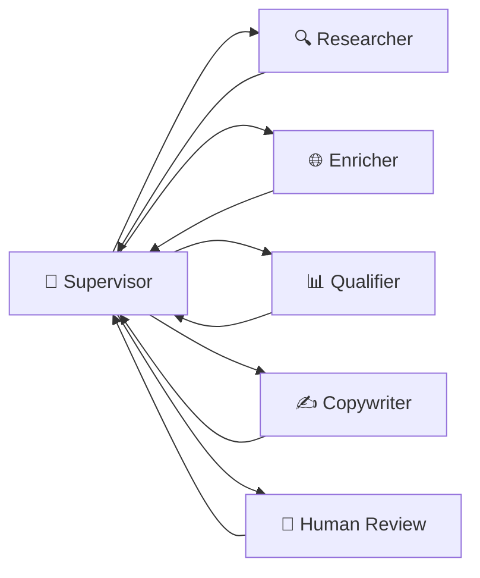
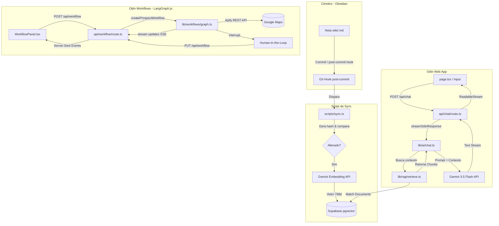

# ⚡ Odin — Cockpit de IA Pessoal & Orquestrador Multi-Agente 🤖

O **Odin** é um assistente de inteligência artificial pessoal com duas grandes capacidades:

1. **Chat com Segundo Cérebro** — Conversação em streaming com RAG sobre um vault Obsidian (pgvector), function calling, voz bidirecional e interface 3D imersiva.
2. **Workflows Multi-Agente** — Orquestração de agentes especialistas via LangGraph.js para tarefas complexas como prospecção B2B, com human-in-the-loop e dados reais do Google Maps.

---

## Status honesto

**Protótipo pessoal funcional, single-user, feito para rodar local.** Não há autenticação,
não há deploy público, e o `.env.local` é a única forma de configurar credenciais.

O que **não** existe, dito antes que você descubra: zero testes, zero CI, zero evals, e
`npm run lint` está vermelho na `main` (15 erros, em maioria regras do React Compiler).
`npm run build` passa. O inventário completo — com `arquivo:linha` para cada afirmação —
está em [`docs/ESTADO.md`](./docs/ESTADO.md) §2.

## Como ler este repositório

Se você tem quinze minutos e quer avaliar o raciocínio, não o volume de código:

| Leia | Porque |
|---|---|
| [`docs/ESTADO.md`](./docs/ESTADO.md) | O retrato verificado do sistema: o que existe, o que falta, o que está ambíguo. Toda linha cita `arquivo:linha`. §2.1 conta por que este documento passou a existir |
| [`docs/adr/0003`](./docs/adr/0003-supervisor-deterministico.md) | A decisão mais cara do projeto, tomada depois de um bug de loop infinito: **LLM para cognição, TypeScript para controle** |
| [`docs/adr/0009`](./docs/adr/0009-regra-do-turno.md) | O critério que decide quando escalar para um grafo — e quando não. Evita construir agente por construir |
| [`docs/adr/`](./docs/adr/) | As onze decisões, com o que foi descartado e o que estamos pagando por cada escolha |

---

## 🌌 Visão Geral da Interface

A interface do Odin funciona em duas abas: **Chat** (assistente pessoal) e **⚡ Agents** (workflows multi-agente).

* **Robô 3D Interativo (Spline):** Modelo 3D que reage em tempo real — gaze tracking e glow pulse sincronizado com a voz.
* **Background Dinâmico WebGL:** Shader animado em Three.js.
* **Glassmorphism & UI Cyberpunk:** Controles semi-transparentes, tons neon, cursor crosshair.
* **Workflow Panel:** Grafo visual dos agentes com status em tempo real, log de eventos e painel de revisão humana com botão WhatsApp integrado.

---

## 🧠 Recursos Principais

### 1. Chat com RAG Integrado (Obsidian & Supabase) 📚

O Odin lê e indexa notas pessoais do Obsidian, respondendo com contexto real da sua vida e projetos.

* **Indexação Incremental (`npm run sync`):** Verifica alterações via hash SHA-1 e indexa apenas arquivos novos/modificados.
* **Auto-Sync:** Git Hook `post-commit` no vault dispara sincronização automática.
* **Armazenamento Vetorial:** Supabase (PostgreSQL) + `pgvector` com índice HNSW para busca por similaridade ultrarrápida.
* **Embeddings:** `gemini-embedding-001` otimizados para 768 dimensões.

### 2. Conversação por Voz (STT & TTS) 🎙️

* **Speech-to-Text (STT):** Web Speech API com envio automático na pausa natural.
* **Text-to-Speech (TTS):** OpenAI TTS (`tts-1`, voz onyx), em fila por frase para falar enquanto o resto é gerado.
* **Modo Conversa Contínua (Hands-Free):** Meia-duplex com reativação automática do microfone.
* **Glow Pulse (Lip-Sync Visual):** Anel neon pulsa no ritmo da voz via Web Audio (`AnalyserNode`).
* **Barge-in:** Áudio interrompido ao iniciar novo comando.

### 3. Function Calling 🛠️

O Odin executa ações no servidor via loop de ferramentas:

* **`searchSecondBrain`:** Busca semântica no vault Obsidian.
* **`readObsidianNote`:** Lê nota inteira (com guard de path-traversal e confidencialidade).
* **`webSearch`:** Busca web via Tavily (fallback mock sem chave).
* **`getSurfForecast`:** Surf e tempo em Peruíbe/SP via Open-Meteo (Marine + Weather).

### 4. Workflows Multi-Agente (LangGraph.js) 🔗

Módulo de orquestração de agentes especialistas usando **LangGraph.js** com padrão **Supervisor (Hub-and-Spoke)**.

#### Arquitetura do Grafo



O caminho que executa: `researcher → enricher → qualifier → copywriter → human_review`.
Todo branch do Supervisor é **derivado do estado** — não há flag para resetar.
Ver [`docs/ESTADO.md`](./docs/ESTADO.md) §1.

#### Agentes Especialistas

| Agente | Papel | Tecnologia |
|--------|-------|------------|
| **Supervisor** | Roteador determinístico — decide o próximo estágio a partir do estado | Regras TypeScript (sem LLM) |
| **Researcher** | Descobre **quem existe** e filtra quem já foi contatado | Apify Google Maps (fallback: Tavily → mock) |
| **Enricher** | Descobre **como é** — abre o site de cada lead, em paralelo | Firecrawl (`/v2/scrape` → markdown) |
| **Qualifier** | Pontua todos os leads de uma vez, sobre o conteúdo real do site | Gemini 3.5 Flash + Structured Output |
| **Copywriter** | Escreve a mensagem de cada lead (máx. 5 linhas, tom inferido do segmento) | Gemini 3.5 Flash + prompt battle-tested |
| **Human Review** | Pausa o workflow via `interrupt()` para revisão humana | LangGraph HITL |

> **Por que dois scrapers?** Não são concorrentes: o Apify **descobre** (diretório fechado
> do Maps — o Firecrawl não consegue listar "todas as pizzarias de Itanhaém") e o Firecrawl
> **enriquece** (web aberta, dado que já temos a URL). Ver
> [ADR-0011](./docs/adr/0011-apify-descoberta-firecrawl-enriquecimento.md).

#### Funcionalidades do Workflow

* **Descoberta real:** dados de empresas via Google Maps (nome, telefone, website, rating, endereço).
* **Qualificação sobre fato:** o Qualifier recebe o conteúdo real do site, não só a URL — o critério "site desatualizado" deixou de ser adivinhação.
* **Mensagem pronta e editável:** o Copywriter gera a abordagem de cada lead; a tabela traz um textarea e o link `wa.me?text=` é **remontado no clique**, então as edições vão junto.
* **Contexto de demo:** campo opcional por run. Preenchido, o Copywriter menciona a demo com verdade; vazio, é instruído a não prometer nada. Nunca inclui URL — link em WhatsApp frio derruba resposta.
* **Nunca re-contata:** `lead_key` estável (telefone normalizado ou hash de nome+local); quem já foi abordado é filtrado **na frente** do pipeline, poupando tokens.
* **"Contatado" vem do clique:** o grafo não consegue observar o envio, então quem afirma o contato é a UI (`POST /api/leads/contacted`), não o workflow.
* **Human-in-the-Loop:** pausa via `interrupt()`; a UI oferece **Concluir**, **Descartar** e **CSV**.
* **Streaming SSE:** progresso em tempo real por nó.
* **Checkpointing:** MemorySaver (dev, `globalThis` singleton); caminho Redis existe em código mas o pacote não está instalado.

### 5. Engenharia de Chat Robusta & Agnóstica ⚡

* **Provider Isolado:** Contrato estável de streaming. Gemini hoje, agnóstico para multi-modelos.
* **Retry com Backoff:** Rate limit (429) e sobrecarga (503) repetidos com backoff exponencial.
* **Fail-Safe:** Supabase offline? RAG falha silenciosamente. Sem chave Apify? Cai no Tavily. Sem Tavily? Mock. O Odin nunca trava.

---

## 🏗️ Arquitetura do Fluxo de Dados



---

## 🛠️ Tecnologias Utilizadas

| Camada | Tecnologia |
|--------|-----------|
| **Framework** | Next.js 16.2 (App Router, Turbopack) |
| **Estilização** | Tailwind CSS v4, Vanilla CSS (Glassmorphism) |
| **3D / Gráficos** | `@splinetool/react-spline` & `Three.js` (WebGL Shader) |
| **Banco de Dados** | Supabase (PostgreSQL) + `pgvector` |
| **IA (Chat)** | `@google/genai` (Gemini 3.5 Flash) com Function Calling |
| **IA (Workflows)** | `@langchain/langgraph` (StateGraph, Supervisor Pattern) |
| **Scraping** | Apify REST API (Google Maps Scraper) |
| **Voz** | Web Speech API (STT) + OpenAI TTS + Web Audio |
| **Dados Externos** | Open-Meteo (Marine & Weather) para surf |

---

## 🔒 Segurança e escopo

Este repositório é uma **demonstração de engenharia**, não um serviço. O modelo de ameaça
assumido é "roda no meu laptop", e as consequências disso estão declaradas aqui em vez de
descobertas por quem clonar.

**O que o código protege:**

* **Segredo nunca entra no repo.** Todas as credenciais vêm de `.env.local`, que é
  gitignorado. Só o `.env.local.example` — com campos vazios — é versionado.
* **Vault é somente leitura.** Nenhum caminho de código escreve no Obsidian
  ([ADR-0002](./docs/adr/0002-vault-fonte-de-verdade.md)).
* **Hard guard de confidencialidade.** `getHardExclude()` em `lib/vault.ts` bloqueia pastas
  sensíveis **no sync e na leitura**, e falha fechado: `VAULT_EXCLUDE` vazio ou malformado
  cai no default em vez de desligar o guard.
* **Guard de path-traversal.** `readObsidianNote` resolve o alvo e recusa qualquer caminho
  que escape da raiz do vault — a tool é exposta ao LLM, então o argumento é entrada não
  confiável por definição.
* **Chaves só no servidor.** Nenhuma credencial cruza para o client; TTS, Gemini, Apify e
  Firecrawl são chamados de route handlers.
* **`/api/sync` falha fechado.** É a única rota que spawna processo. Liberada em dev;
  em produção exige `SYNC_TOKEN`, e recusa todo mundo se o token não estiver configurado.

**O que ele não protege — porque não é o escopo:**

* **Não há autenticação.** As rotas `/api/chat`, `/api/workflow`, `/api/tts` e
  `/api/suggestions` são abertas a quem alcançar o processo. Rodando em `localhost`, isso é
  o desenho; exposto à internet, é queima de cota de API por qualquer um.
* **Não há rate limit** nem orçamento por sessão.
* **Não há RLS no Supabase** — o acesso é via `service_role` a partir do servidor.

> **Antes de qualquer deploy público:** auth nas rotas, rate limit e `SYNC_TOKEN`
> configurado. O item de deploy no roadmap depende disso, não o contrário.

---

## 🚀 Como Rodar o Projeto Localmente

### 1. Clonar o repositório
```bash
git clone https://github.com/gfrabelo/odin.git
cd odin
```

### 2. Configurar Variáveis de Ambiente
```bash
cp .env.local.example .env.local
```
Preencha com suas credenciais:

| Variável | Obrigatória | Descrição |
|----------|:-----------:|-----------|
| `GEMINI_API_KEY` | ✅ | Chave API do Google AI Studio |
| `OPENAI_API_KEY` | — | Para voz (TTS). Sem ela, chat funciona sem áudio |
| `SUPABASE_URL` | — | URL do projeto Supabase (RAG) |
| `SUPABASE_SERVICE_ROLE_KEY` | — | Service role key do Supabase |
| `VAULT_PATH` | — | Caminho local do vault Obsidian (padrão: `../segundo-cerebro`) |
| `VAULT_EXCLUDE` | — | Pastas do vault sempre bloqueadas, separadas por vírgula. Somadas ao default `confidencial` |
| `APIFY_API_TOKEN` | — | Token Apify para o Google Maps Scraper — **descoberta** de leads |
| `FIRECRAWL_API_KEY` | — | Token Firecrawl — **enriquecimento** (abre o site do lead). Sem ela, o Enricher é pulado |
| `SEARCH_API_KEY` | — | Chave Tavily para busca web real |
| `SYNC_TOKEN` | — | Só em produção: libera `POST /api/sync`. Sem ele, a rota recusa em produção |

### 3. Configurar o Banco de Dados (Supabase)
No painel SQL Editor do Supabase, execute **os dois** arquivos:

* `supabase/schema.sql` — pgvector e `documents` (RAG sobre o vault)
* `supabase/prospect.sql` — `prospect_runs` e `leads` (memória da prospecção)

> Sem o `prospect.sql`, o workflow roda normalmente e **nada é gravado** — a persistência
> é fail-safe por desenho. O sintoma é o pipeline re-oferecendo leads já contatados.

### 4. Instalar Dependências e Rodar
```bash
npm install
npm run dev
```
Cockpit ativo em [http://localhost:3000](http://localhost:3000).

### 5. Sincronizar o Vault Obsidian (RAG)
```bash
npm run sync
```

---

## ✅ Entregue

* [x] Chat em streaming com Gemini (fallback OpenAI)
* [x] RAG sobre vault Obsidian via Supabase/pgvector
* [x] Function Calling (4 tools: searchSecondBrain, readObsidianNote, webSearch, getSurfForecast)
* [x] Voz bidirecional (STT nativo + TTS OpenAI) com modo contínuo hands-free
* [x] Glow Pulse sincronizado com voz (Web Audio AnalyserNode)
* [x] Barge-in inteligente
* [x] UI imersiva com robô 3D (Spline), glass UI, background WebGL
* [x] **Workflow Multi-Agente (LangGraph.js)** — grafo hub-and-spoke, supervisor determinístico com branches derivados do estado
* [x] **Apify Google Maps Scraper** — leads reais com telefone, website, rating
* [x] **Enriquecimento via Firecrawl** — conteúdo real do site alimenta a qualificação
* [x] **Qualificação em batch** — uma chamada estruturada pontua e ranqueia todos os leads; corte `score >= 6` aplicado em código
* [x] **Copywriter em batch** — mensagem por lead, correlacionada por índice
* [x] **Link wa.me com mensagem** — `?text=` remontado no clique a partir do texto editado
* [x] **Persistência de leads e runs** — `lead_key` único; nunca re-contata o mesmo negócio
* [x] **Exportar CSV** — a tabela inteira, com as mensagens editadas
* [x] **Human-in-the-loop** — `interrupt()`/resume com checkpointing
* [x] **Fail-safe em cascata** — Apify → Tavily → mock; sem Firecrawl, qualifica só com Maps; sem Supabase, roda sem memória

> Para o retrato completo e verificado — incluindo o que **não** funciona — ver
> [`docs/ESTADO.md`](./docs/ESTADO.md). Este checklist lista entregas; aquele documento
> lista lacunas, com `arquivo:linha`.

## 🗺️ Roadmap

**Destrava credibilidade (próximo)**
* [ ] **Zerar os erros de lint** — `npm run lint` está vermelho na `main`; consertar antes de montar CI
* [ ] **Harness de evals** — aderência do copywriter às regras, consistência do qualifier, recall do RAG
* [ ] **`typecheck` + CI** — lint, typecheck e build no push
* [ ] **Recuperação escopada por domínio** — parsear frontmatter no sync (ver [ADR-0010](./docs/adr/0010-metadado-do-frontmatter.md))

**Depois**
* [ ] **Deploy Railway + Redis** — checkpointing persistente + HTTPS
* [ ] **Persistência de Conversas** — múltiplos chats com histórico
* [ ] **Visão Multimodal** — enviar imagens/screenshots para análise
* [ ] **Escrita no Vault** (`writeObsidianNote`) — ⚠️ revoga o [ADR-0002](./docs/adr/0002-vault-fonte-de-verdade.md); exige decisão explícita antes

**Adiado, com gatilho explícito**
* ⏸ **Sender automático (Uazapi/Z-API)** — o `wa.me` + clique humano é *melhor* enquanto a mensagem não estiver provada: custo zero, risco de ban zero, humano no loop por construção. Automatizar o disparo antes de fechar o primeiro contrato não escala vendas, escala queima de lead — e destrói a propriedade que o copywriter mais persegue ("parece digitada no celular"). **Gatilho:** primeiro contrato fechado *e* envio manual virando gargalo medido. Ver [ADR-0007](./docs/adr/README.md)

---

## Licença

[MIT](./LICENSE). O código é livre; as anotações do vault que alimentam o RAG **não**
fazem parte deste repositório e vivem noutro lugar
([ADR-0002](./docs/adr/0002-vault-fonte-de-verdade.md)).
